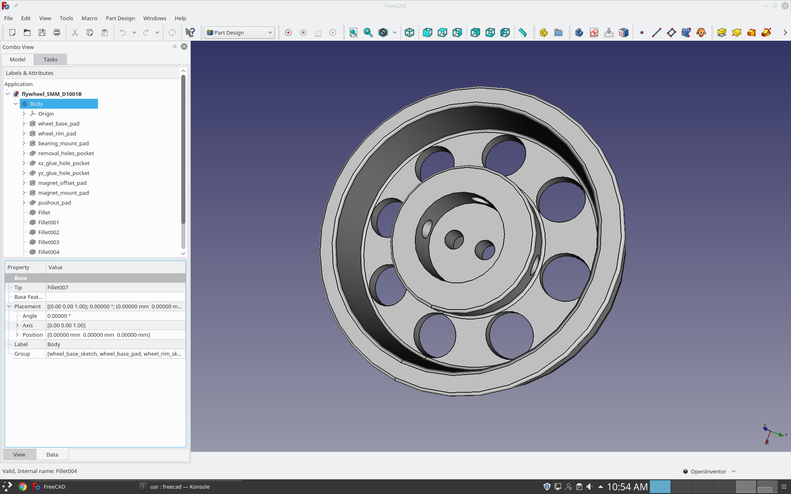
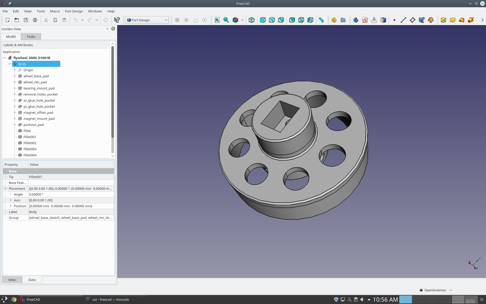
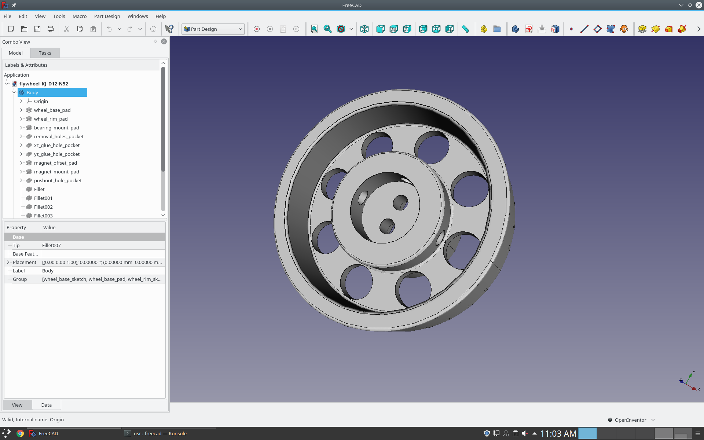
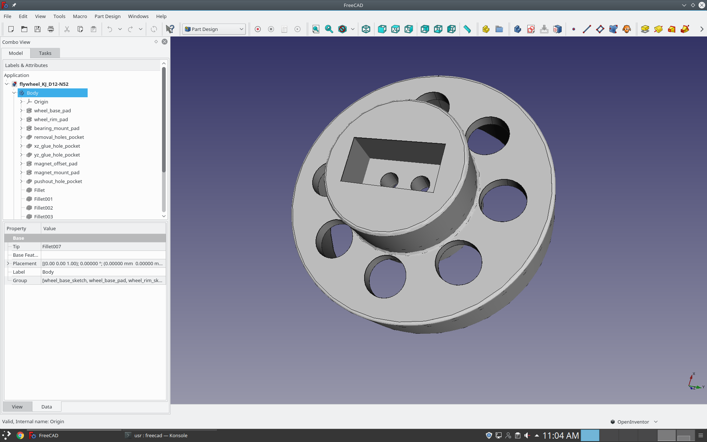

## flywheel_cad  

CAD designs for the flywheel fruit fly treadmill project.

###  flywheel_SMM_D1001B
Flywheel design for use with supermagnetman D1001B cyclidrical magnet and the Atoplee 100pcs Miniature 681ZZ 1x3x1mm bearing.

###  flywheel_kJ_D12-N52
Flywheel design for use with K&J Magnetics D12-N52 cylindrical magnet and the Atoplee 100pcs Miniature 681ZZ 1x3x1mm bearing.

